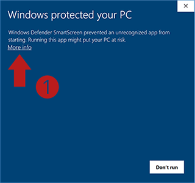
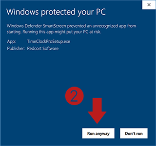

# Screen Layout Tool

## 1. Overview

Screen Layout Tool is a open source software to help you organize and arrange windows on your computer screen, especially when using multiple monitors or working with multiple applications.

Screen Layout Tool committed to making multi-screen window management more efficient, precise and smooth.

[Demo video](videos/demo.mp4)

## 2. It is easy to use

**Fast Select Layout Solution**

Use the right-click menu of the tray icon or hotkeys to select a layout solution.

| hotkey                         | description            |
| :----------------------------- | :--------------------- |
| `Win` + `Shift` + `MouseWheel` | Change layout solution |
| `Win` + `Shift` + `←` / `→`    | Change layout solution |

- The Screen Layout Tool has two commonly used layout solutions built-in.
- You can also design your own layouts or import layout solutions shared by others.

**Fast Switch Window Position**

Use the hotkeys to switch the position of the current window in the layout solution.

| hotkey               | description            |
| :------------------- | :--------------------- |
| `Win` + `MouseWheel` | Change window position |
| `Win` + `←` / `→`    | Change window position |

- The first stop for a window is the closest position in layout when Previous/Next be used.
- Roughly adjust the window's size and position to your desired, then switch, It's very likely what you want.

## 3. You can import layouts you like

You can import layout solutions shared by others.

- Download your favorite layout file from [official community](https://www.reddit.com/r/ScreenLayoutTool/).
- Click "Open Layout Folder" in the right-click menu of the tray icon to put the layout file in it.
- Click "Reload", the layout solution will appear in "Layout" menu.

## 4. You can easily design your layout

You can also design your own screen layout solution using the `.json` file.

```json
{
  "author": "Tyx",
  "name": "Default",
  "version": "1.0",
  "description": "Default layout solution",
  "positions": [
    {
      "left": 0,
      "width": 20,
      "top": 0,
      "height": 100,
      "monitor": 0
    },
    {
      "right": 0,
      "width": 20,
      "top": 0,
      "height": 100,
      "monitor": 1
    },
    {
      "top": 20,
      "bottom": 20,
      "left": 20,
      "right": 20,
      "monitor": 2
    }
  ]
}
```

| no. | field   | unit | range | description                 |
| :-: | ------- | :--: | :---: | --------------------------- |
|  1  | height  |  %   | 0-100 | Height of the window        |
|  2  | top     |  %   | 0-100 | Distance from edge to edge  |
|  3  | bottom  |  %   | 0-100 | Distance from edge to edge  |
|  4  | width   |  %   | 0-100 | Width of the window         |
|  5  | left    |  %   | 0-100 | Distance from edge to edge  |
|  6  | right   |  %   | 0-100 | Distance from edge to edge  |
|  7  | monitor |      | 0-100 | Monitor number, 0: primary. |

- 1-3 must choose 2.
- 3-4 must choose 2.
- 7 is optional, the default is 0.

## 5. Supported Operating Systems

Windows 7 / Windows 10 / Windows 11

## 6. Download and Install

Screen Layout Tool is green software and requires no installation. Download the latest version from [Download](https://github.com/forw-dev/screen-layout-tool/releases), unzip it and run launcher.exe to start using it.

## 7. Windows Protected Your PC

When you run the Screen Layout Tool for the first time, you may get a message like: "Windows Defender SmartScreen prevented an unrecognizable app from starting. Running this app might put your PC at risk."

Don't worry, there is no risk.

The Windows Defender SmartScreen is a way for Microsoft to alert you that an app seems suspicious. Microsoft said that when enough users have accepted the program and its reputation has been established, the prompt will stop appearing. More about Windows Defender SmartScreen ...

You can safely ignore this message and continue:

Select the More Info link.
Click the Run anyway button.




